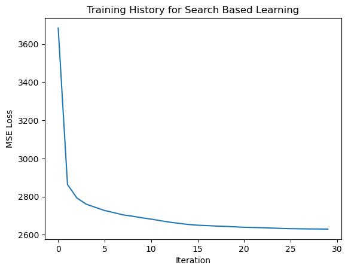
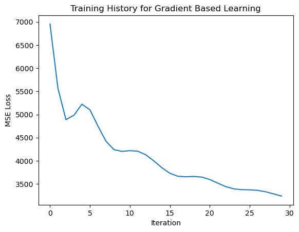
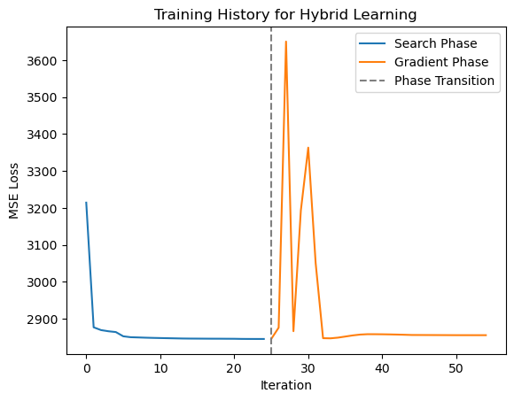
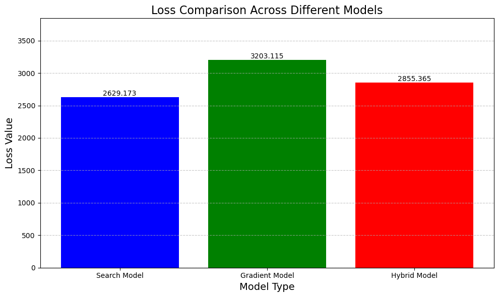

# Neural-Networks-Learning-Without-Gradient-Descent

This repository implements an experimantal approach to training neural networks without relying solely on traditional gradient-based methods. We explore a **search-based learning** mechanism, where individual parameters are optimized by directly minimizing the loss function. Additionally, we compare these methods with conventional gradient-based techniques to evaluate the effectiveness of each approach.

## Table of Contents
- [Introduction](#introduction)
- [Models](#models)
  - [Search Model](#search-model)
  - [Gradient Model](#gradient-model)
  - [Hybrid Model](#hybrid-model)
- [Usage](#usage)
- [Results and Comparison](#results-and-comparison)
  - [Training History](#training-history)
  - [Loss Comparison](#loss-comparison)
- [Conclusion](#conclusion)

## Introduction

Neural networks are commonly trained using gradient-based methods like backpropagation, which adjust the network's parameters to minimize a loss function. However, this approach has certain limitations:
- **Gradient vanishing/exploding issues**
- **Sensitivity to local minima**
- **Need for differentiable loss functions**

To address these challenges, we explore a **search-based method** where we exhaustively search over parameter ranges to minimize the loss without relying on gradients. The repository also includes:
1. A **search-based model** that optimizes each parameter through a brute-force search.
2. A **gradient-based model** for traditional optimization comparison.
3. A **hybrid model** that combines the benefits of both approaches.

## Models

### Search Model
The **SearchModel** is built on top of the `BaseModel`. Instead of relying on gradient-based optimization, the model searches over specific ranges of weights and biases to find the values that minimize the loss function.

- **Parameter Search**: For each weight and bias, we perform a search within the defined range, finding the value that results in the lowest loss.
- **Early Stopping**: The search can stop early if the loss converges below a certain tolerance level.

```python
search_model = SearchModel(input_size=10, hidden_sizes=[5, 4], output_size=1,
                           weight_range=[-5, 5], bias_range=[-5, 5], 
                           weight_range_size=100, bias_range_size=100)

history_search = search_model.search(X, y, max_iterations=30)
```

### Gradient Model
The **GradientModel** uses traditional gradient-based optimization (Adam optimizer) to update the network parameters. This serves as a baseline for comparison with the search-based approach.

```python
gradient_model = GradientModel(input_size=10, hidden_sizes=[5, 4], output_size=1)
history_grad = gradient_model.train_model(X, y, num_epochs=30, learning_rate=0.1)
```

### Hybrid Model
The **HybridModel** combines both search-based and gradient-based techniques. It first performs a parameter search and then refines the results using gradient descent.

```python
hybrid_model = HybridModel(input_size=10, hidden_sizes=[5, 4], output_size=1)
history_hybrid = hybrid_model.search_and_train(X, y, num_iterations=30, learning_rate=0.1)
```


## Usage

To run the models and visualize the results, execute the `comparison.ipynb` notebook. This notebook loads a dataset, trains the models, and displays the training history and final loss values for each model.

```bash
jupyter notebook comparison.ipynb
```

## Results and Comparison

### Training History

Each model's training history is visualized to observe how the loss decreases over iterations.

#### Search-Based Learning


#### Gradient-Based Learning


#### Hybrid Model Training


### Loss Comparison

The bar chart below compares the final loss across the different models:



- **Search Model**: Optimizes through brute-force parameter search.
- **Gradient Model**: Traditional backpropagation with Adam optimizer.
- **Hybrid Model**: Combines the search and gradient-based approaches.

## Conclusion

This research demonstrates an experimental approach to neural network optimization that does not rely solely on gradients. The search-based model offers an alternative mechanism, particularly useful when gradient methods face challenges, such as non-differentiable functions or poor convergence.

Overall, this work opens up new possibilities for training neural networks, especially in cases where traditional methods struggle. Future research could explore more efficient search algorithms, integrate additional optimization techniques, or apply this approach to more complex neural network architectures and real-world tasks.


---