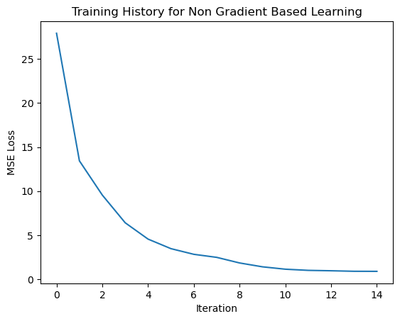
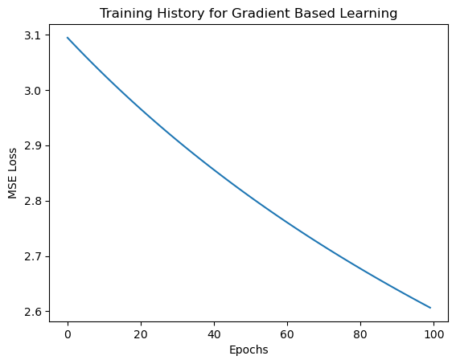

# Neural Networks Learning Without Gradient Descent

This repository explores alternative approaches to training neural networks without the use of traditional gradient-based methods. The focus is on using brute force search and optimization strategies to minimize loss and improve model performance.

## Overview

In traditional neural network training, gradient descent is used to adjust the weights and biases to minimize the loss function. This project aims to implement and experiment with **non-gradient-based learning techniques**, such as:
- **Parameter Search Optimization**: Brute force search across predefined weight and bias ranges.
- **Hybrid Optimization**: Combining search-based methods with gradient descent (in progress).

### Key Features
- **Customizable Neural Network Architecture**: The model is highly configurable with variable input, hidden, and output layers.
- **Search-Based Optimization**: Search through predefined weight and bias values to find optimal parameters that minimize the loss function.
- **Learning Comparison**: Compare search-based learning with traditional gradient-based methods.
- **Evaluation and Visualization**: Built-in methods for loss evaluation and visualization of training progress.

### Key Files
- **`base_model.py`**: Defines the neural network `MyModel`, including initialization, forward pass, parameter search, and gradient-based training.
- **`train.ipynb`**: Runs the training scripts, evaluates the model, and visualizes the learning curves for both optimization techniques.

## Results

### Non-Gradient-Based Training Loss:

### Gradient-Based Training Loss:

The visualizations show the difference in loss reduction between the two methods over time.

---
